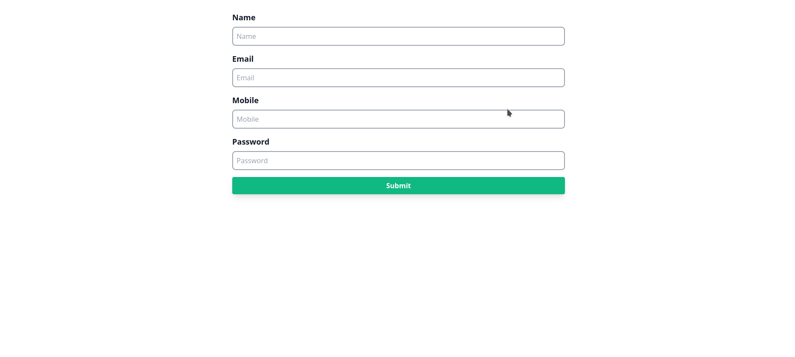
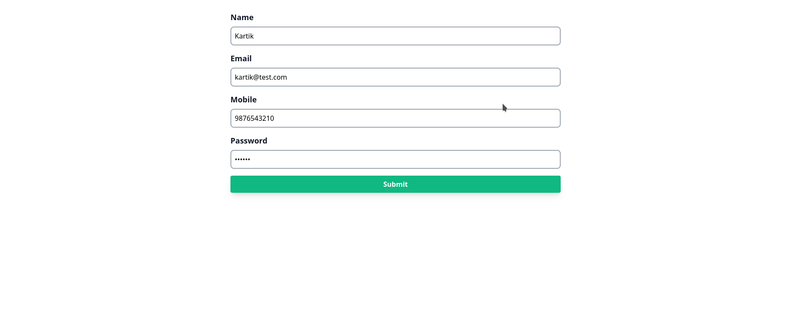

# Aplicación CRUD de PHP

Este repositorio contiene una aplicación PHP CRUD (Create, Read, Update, Delete) simple. Es una demostración básica de cómo integrar PHP con una base de datos MySQL para gestionar datos de usuarios. La aplicación permite a los usuarios agregar, ver, editar y eliminar información de usuario.

## Que es CRUD?

-En programación solemos usar el término CRUD para referirnos a las operaciones básicas que puedes realizar sobre un conjunto de datos y por sus siglas son:
-Crearlos, ya sabes, nuevos registros, cuando hablamos de bases de datos esto quiere decir insertar información.
-Leerlos, r por Read, esto quiere decir consultar esa información, ya sea un registro o una colección de estos registros.
-Actualizarlos, u por Update, que significa tomar un registro que ya existe en la base de datos y modificar alguna de las columnas.
-Por último eliminar registros, d por Delete, que significa tomar un registro y quitarlo del almacén.

## Ventajas de CRUD

-Simplicidad y facilidad de uso
-Estandarización
-Flexibilidad y escalabilidad
-Integridad y seguridad de los datos
-Eficacia y rendimiento
-Reutilización del código

##Desventajas de CRUD

-CRUD está diseñado principalmente para operaciones simples de base de datos. Cuando las operaciones se vuelven más complejas, como consultas avanzadas o transacciones complejas, CRUD puede volverse limitado y poco eficiente
-En sistemas distribuidos o en redes de área amplia, las operaciones CRUD pueden generar una sobrecarga de red significativa.
-A medida que una aplicación crece y maneja grandes volúmenes de datos y tráfico, el enfoque CRUD puede enfrentar desafíos de escalabilidad
La gestión de la consistencia de los datos puede ser un desafío con operaciones CRUD, especialmente en sistemas distribuidos o concurrentes. Sin la implementación adecuada de controles de concurrencia y transacciones, puede ocurrir inconsistencia de datos, lo que afecta la integridad de la aplicación.

## Tecnologías Utilizadas

- **PHP:** Lenguaje de script del lado del servidor utilizado para el desarrollo web.
- **MySQL:** Sistema de gestión de base de datos utilizado para almacenar datos de usuario.
- **HTML & CSS:** Utilizados para estructurar y dar estilo a las páginas web.
- **Tailwind CSS:** Un framework de CSS utilitario para el desarrollo rápido de interfaces de usuario.

## Páginas y Funcionalidades

### 1. Página de Inicio (`display.php`)

- **Funcionalidad:** Muestra todos los usuarios de la base de datos en un formato de tabla.
- **Características:** 
  - Ver todos los usuarios.
  - Enlaces de navegación para agregar, editar o eliminar información de usuario.

### 2. Agregar Usuario (`user.php`)

- **Funcionalidad:** Permite agregar un nuevo usuario a la base de datos.
- **Características:** 
  - Formulario para ingresar detalles del usuario (nombre, correo electrónico, teléfono móvil, contraseña).
  - Validación de datos y envío a la base de datos.

### 3. Editar Usuario (`edit.php`)

- **Funcionalidad:** Permite editar detalles de usuarios existentes.
- **Características:** 
  - Formulario prellenado con la información actual del usuario.
  - Actualización de detalles del usuario en la base de datos.

### 4. Eliminar Usuario (`delete.php`)

- **Funcionalidad:** Facilita la eliminación de un usuario de la base de datos.
- **Características:** 
  - Eliminación de información de usuario basada en el ID de usuario.

## Conexión a la Base de Datos (`connect.php`)

- **Propósito:** Establece una conexión con la base de datos MySQL.
- **Credenciales:** Utiliza nombre de host, nombre de usuario, contraseña y nombre de la base de datos para la conexión.

## Cómo Ejecutar

1. Clona el repositorio en tu máquina local.
2. Configura un entorno PHP y MySQL (como XAMPP).
3. Crea la base de datos usando phpmyadmin.
4. Ejecuta la aplicación en un servidor local.

## Ejemplos de aplicaciones del CRUD
-Sistemas de Gestión de Contenidos (CMS)
Estos sistemas permiten a los usuarios crear, leer, actualizar y borrar contenidos en sitios web o blogs. Los usuarios pueden crear nuevas entradas o páginas, leer el contenido existente, actualizar o editar el contenido y eliminar el contenido obsoleto o irrelevante. 
-Plataformas de comercio electrónico
utilizan en gran medida las operaciones CRUD para gestionar los catálogos de productos, el inventario y los datos de los clientes. Por ejemplo, una tienda online permite a los usuarios crear nuevos listados de productos, leer los detalles del producto, actualizar la información del producto, como el precio o la disponibilidad, y eliminar los productos que ya no están en stock. 
-Aplicaciones para redes sociales
se basan en operaciones CRUD para gestionar diversas interacciones entre los usuarios y el contenido. Los usuarios pueden crear nuevos posts, leer posts de sus conexiones o feeds públicos, actualizar la información de su perfil o el contenido de sus posts, y borrar sus propios posts o comentarios. 

## Nota de Seguridad

Esta aplicación es una demostración básica y no implementa medidas avanzadas de seguridad. Es recomendable utilizar declaraciones preparadas (prepared statements) u ORM para las interacciones con la base de datos para prevenir ataques de inyección SQL.

---

Siéntete libre de contribuir a este proyecto o sugerir mejoras. Para cualquier consulta o problema, por favor abre un issue en este repositorio.

